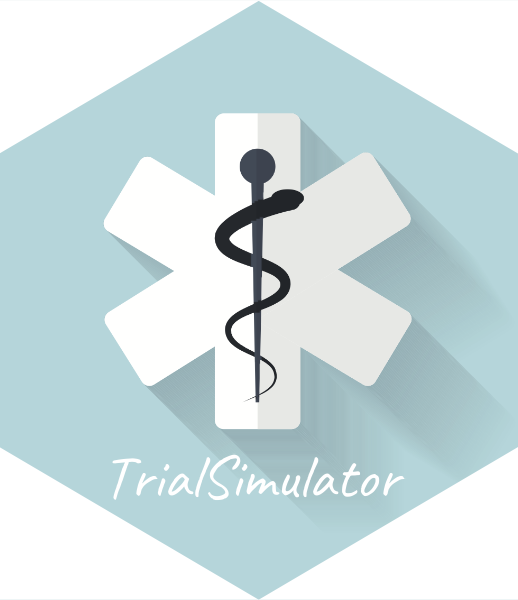

# Shiny App for `TrialSimulator` 

**&#x2695; No more `for` loop in clinical trial simulation &#x2695;**

This Shiny app enables users of the R package `TrialSimulator` to generate R codes for simulation by specifying simulation settings from UI. 

## Installation

You can install the development version of `TrialSimulator` from [GitHub](https://github.com/zhangh12/TrialSimulator) with:

``` r
if (!require("remotes")) {
  install.packages("remotes")
}
remotes::install_github(
  "zhangh12/TrialSimulator", 
  build_manual = TRUE, 
  build_vignettes = TRUE, 
  force = TRUE
)
```

To launch the Shiny app, execute
``` r
runApp()
```
in the folder containing `app.R`. 
